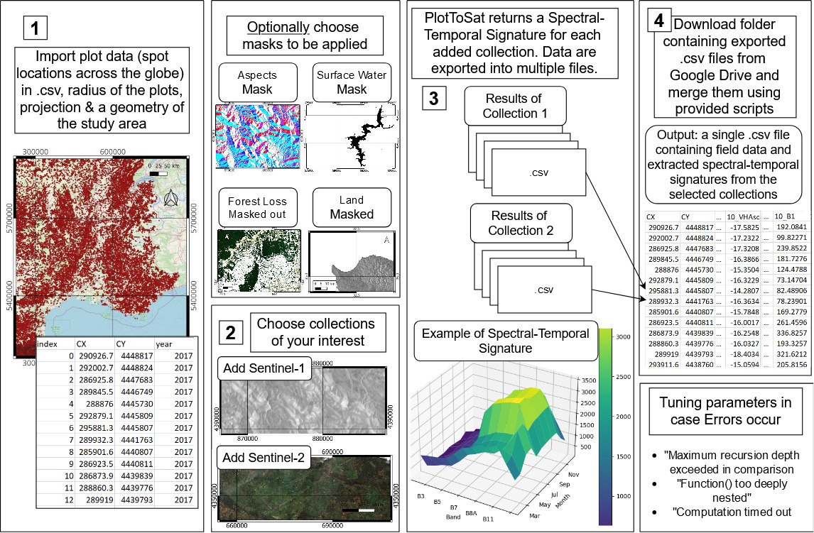
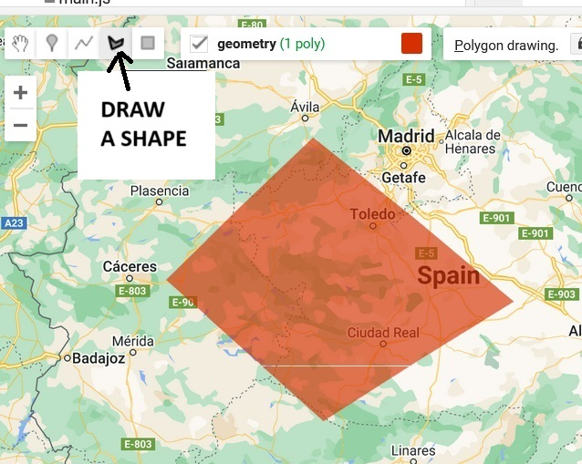
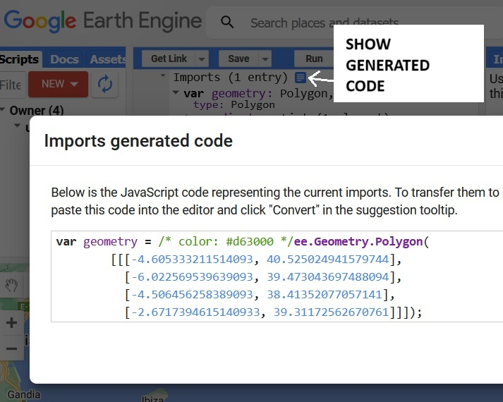
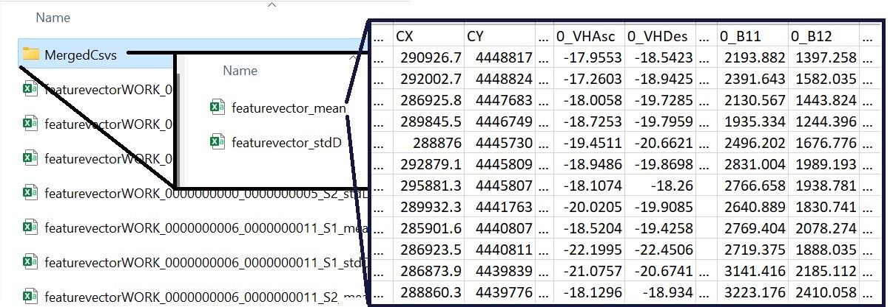
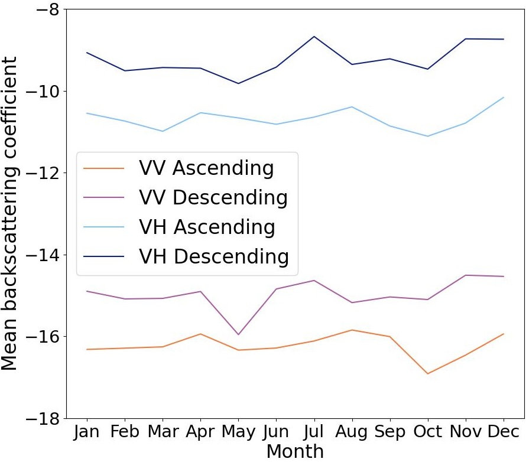
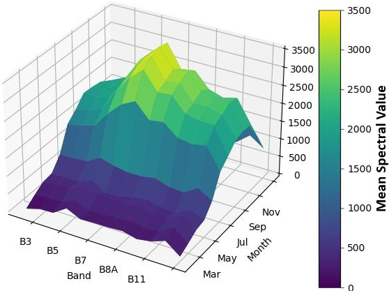

# User guide for PlotToSat
## A tool for generating time-series signatures from Sentinel-1 and Sentinel-2 at field-based plots for Machine Learning Applications

The following associated paper should be cited in every publication using
PlotToSat: 
Miltiadou, M., Grieve, S., Ruiz-Benito, P., Astigarraga, J.,
Cruz-Alonso, V., Triviño, J.T., and Lines, E. (2024) PlotToSat: A Tool
for Generating Annual Time-Series from Sentinel-1 and Sentinel-2 at Each
Plot Within a Plot Network for Machine Learning Applications _Computers
& Geosciences_

Link to paper: [\<url\>](<url>)

## 1 <a id="secintroduction"></a>  Introduction 


Forest ecologists gather data from predetermined sites known as plots.
Plots are usually circular; defined by a their centre (latitude,
longitude) and a radius. A plot network consists from a few to hundreds
of thousands of plots, which are systematically placed to represent the
forests of region e.g., a country. PlotToSat takes as input a plot
network, and for each circular plot it extracts time-series of
Sentinel-1 and/or Sentinel-2 collections for a given year --collections
typically refer to organised sets of satellite data. For every plot,
PlotTosat exports twelve values per band per collection corresponding to
the twelve calendar months. Standard deviation is also provided for
quality control.

Figure [1](#figworkflow) shows the user-interface. The user-interface is divided into four main
steps, along with two additional optional steps:

-   Step 1: Define the essential input parameters and create an instance
    of PlotToSat. The compulsory input parameters required for creating
    the instance are: (1) a CSV file that lists the plot locations of a
    plot network, (2) the radius of the plots, (3) the projection of the
    plot data, (4) a geometry defining the study area, and (5) the year
    of interest.

-   Optional Step 1: After Step 1, users can decide whether to apply any
    of the available masks (aspects, surface water, forest disturbance,
    and land mask) to the selected collections.

-   Step 2: PlotToSat currently supports two EO collections (Sentinel-1
    and Sentinel-2). Users can choose to add/use one or both of these
    collections.

-   Step 3: Define the outputs (folder name and start of filenames);
    initially PlotToSat exports the time-series into multiple CSV files,
    which are stored on the user's Google Drive.

-   Step 4: Download the folder containing the exported CSV files from
    Google Drive and merge them using the provided script.

-   Optional Step 2: Tuning provided parameters to tackle potential
    errors that predominantly occur because Google Earth Engine (GEE)
    distributes processing power among its users by implementing
    processing limitations. While users may face GEE errors, we
    recommend solutions e.g., defining how many plots will be exported
    in each file in Step 3.


<p align="center">
  
</p>
<p align="center"><em>Figure 1: User's workflow of the system</em></p>


The system is modular, consisting of multiple classes, yet the user's
interaction is primarily with the PlotToSat class. Each class (e.g.,
*Sentinel-1* class) can function autonomously for other applications and
in the Github repository
(\<<https://github.com/Art-n-MathS/PlotToSat>\>) there is a test-case
for each class. **Only functions included in the associated test cases
should be used, as other functions may not be thoroughly tested and may
not behave as expected.**

The guide explains the User Interface of PlotToSat. For back-end
information and image pre-processing steps, please refer to the
associated paper.

The sample data are randomly created; they are well-distributed and lie
within Peninsular Spain.

## 2 <a id="secinstallation"></a> Installation 

This user guide assumes basic knowledge of Google Earth Engine (GEE) and
Python. A GEE account is also required:
[\<https://code.earthengine.google.com/\>](<https://code.earthengine.google.com/>)

**Important note:** As per current regulations 
([\<https://earthengine.google.com/noncommercial/\>](<https://earthengine.google.com/noncommercial/>), GEE is
free to use for non-commercial purposes by researchers, non-profits,
educators, and government agencies. You can connect GEE to an existing
Google Cloud Platform (GCP) account. If you need to create a new GCP
account, a credit card may be requested during sign-up, but this is
predominantly for verification and not immediate charges. To avoid
unexpected charges, make sure that the cloud-projects created and used
is for non-commercial purposes. In any case, please be considerable of
the usage of GEE resources and cancel faulty tasks (tasks tab available
on the right hand side of the online Graphical User Interface at [\<https://code.earthengine.google.com/\>](<https://code.earthengine.google.com/>).

PlotToSat is implemented using the Python API of Google Earth Engine in
IPython 3 (Jupyter). While Visual Studio Code (VS Code) is recommended
due to its status as a free, open-source, and cross-platform editor,
other IDEs should also work but they have not been tested.

The code is compatible with both Linux and Windows machines and is
available at:
[\<https://github.com/Art-n-MathS/PlotToSat\>](<https://github.com/Art-n-MathS/PlotToSat>)

Depending on your environment, you can install the dependencies as
follows:

``` {#lst:dependancies style="mystyle" label="lstdependancies"}
pip install ipython pandas numpy earthengine-api

conda install -c conda-forge earthengine-api ipython pandas numpy  
```

## 3 <a id="secinstructions">  Instructions: How to extract time-series at plot locations 

Two test cases are provided for using the *PlotToSat* class. Test case 1
(Section [3.1](#seccompcom)) contains the minimal information that needs to
be provided, while test case 2 (Section [3.2](#secoptCom))
includes the optional commands. The data exported on Google Drive are
often divided into multiple subgroups. Section [3.3](#secmergingFiles) explains how to merge the files exported
in Google Drive.

### 3.1 <a id="seccompcom">  Test Case 1: compulsory commands

The simplicity of PlotToSat is demonstrated in Listing
[\[lst:testCode1\]](#lsttestCode1). It runs in an iPython notebook and provides
the code for test case 1 (code available in the associated
*PlotToSat_test1.ipynb* file). The code is broken down and explained in
Sections [3.1.1](#secdefPar), [3.1.2](#secaddCols) and [3.1.3](#secdefOuts).


<a id="lsttestCode1"></a>
```python
# import all the necessary libraries
%run PlotToSat.ipynb
        
# Define study region
polygon = ee.Geometry.Polygon(
    [[[-6.7820312500000135, 37.744682241748094],
      [-1.1570312500000135, 37.32651387565316],
      [0.1613281249999865, 42.25294129803316],
      [-7.3093750000000135, 43.349172765639516]]])
        
# Create a dictionary that holds the relevant plot information
fieldData = {
        "csvfilename"         : "./samplePlots.csv",
        "proj"                : "EPSG:3042",
        "radius"              : 30,
        "xcol"                : "CX",    
        "ycol"                : "CY",
        "outPlotFileWithIDs" : r"plotsWithIDs\SpainIDs_1.csv"
}
        
# Specify the year of interest
year = 2019
        
# Create an instance of the Manager
myPlotToSat = PlotToSat(polygon,fieldData,year) 
        
# Add Earth Observation Collections of interest
myPlotToSat.addCollection("sentinel-1", True) 
myPlotToSat.addCollection("sentinel-2", 50  ) 
        
#Definition and exportation of outputs
myPlotToSat.exportFeatures("folderSpain1", "outfeaturevectors")  
```
<p align="center"><em>Listing 1: This is the "PlotToSat_test1.ipynb" file, which contains a complete example code for extracting time-series EO data at plot locations using PlotToSat.</em></p>


#### 3.1.1 <a id="secdefPar">  Definition of input parameters and creation of a PlotToSat instance 

To begin, generate a new IPython Notebook (.ipynb file) and **run
\"PlotToSat.ipynb\"** to **import all the necessary libraries**. The new
IPython Notebook should be in the same directory as the IPython
Notebooks of PlotToSat. When the libraries are loaded, you are requested
to login to your GEE account and provide access to PlotToSat. Please do
NOT select \"Use read-only scopes\" as PlotToSat exports CSV files in
your Google Drive. Press continue and allow PlotToSat to \"View and
manage your Google Earth Engine data\" and \"Manage your data and
permission in Cloud Storage and see the email address for you Google
Account\". This will allows you to use GEE through the Python API of
GEE. If you do not have a GEE account, Google is requesting you to
create a Google Cloud account first and verification is done by
providing a credit card. As long as PlotToSat and, consequently GEE, are
used for non-commercial purposes, as per current regulations, there are
no associated charges. More info at Section [2](#secinstallation).

Users interact with _PlotToSat_ class. To establish an instance of the _PlotToSat_ class (Line 25 in Listing [1](#lsttestCode1), three inputs are required:
- A polygon that defines the study area
- A dictionary that contains all the relevant information about the field data
- The specific year for exporting the spectral-temporal signatures

**A polygon is required for defining the study region.** Here two examples are given. The first example retrieves a database containing all countries and sets Spain as the study region:

```python
countries = ee.FeatureCollection('USDOS/LSIB_SIMPLE/2017')
polygon = countries.filter(ee.Filter.eq('country_na', 'Spain')) 
```

The second example employs a series of coordinates to define a polygon:

```python
polygon = ee.Geometry.Polygon(
              [[[-4.605333211514093, 40.525024941579744],
              [-6.022569539639093, 39.473043697488094],
              [-4.506456258389093, 38.41352077057141],
              [-2.6717394615140933, 39.31172562670761]]]) 
```

The polygon of the 2nd example was generated using the \"*Draw Shape*\"
feature in the Graphical User Interface (GUI) of GEE. The drawn polygon
is saved in the Imports section, where the corresponding JavaScript code
is provided (Figure [2](#figGEEPol)). To translate the JavaScript code into Python
API code, remove the 'var' declaration, the code enclosed between
\"/\*\" and \"\*/\" (inclusive of \"/\*\" and \"\*/\"), and the
semicolon \";\" at the end.


<table>
  <tr>
    <td>
      
      <p align="center"><em>(a) How to draw a polygon in GEE</em></p>
    </td>
    <td>
      
      <p align="center"><em>(b) How to find the JavaScript code of polygon</em></p>
    </td>
  </tr>
  <tr>
    <td colspan="2" align="center"><em>Figure 2: Drawing a polygon and finding its coordinates to use them in PlotToSat.</em></td>
  </tr>
</table>


**The plot information are stored in a dictionary**, which is a data
structure that stores multiple data in pairs of key-value. The key
\"*csvfilename*\" is associated with the file name and directory of the
CSV file containing the plot data. The key \"*proj*\" refers to the
geographic projection of the plot data. The key \"*radius*\" determines
the radius of the plots; the unit of measurement is in meters. The keys
\"*xcol*\" and \"*ycol*\" are associated with the names of the columns
containing the x and y coordinates of the plots' centres. The key
\"*outPlotFileWithIDs*\" is associated with the name and directory of a
file to be exported. This exported file contains the plot information
but it also attaches identifiers to them. This file with the identifiers
is used for merging the time-series files into one CSV file, along with
the plot information. **At each run, please provide a different file name
for key \"outPlotFileWithIDs\"; otherwise, PlotToSat will overwrite an
existing file with the same name, and merging time-series with plot
information will not be possible.** All the keys of the
dictionary are mandatory. Here is an example of defining them:

```python
fieldData = {
          "csvfilename"        : "./samplePlots.csv",
          "proj"               : "EPSG:3042",
          "radius"             : 30,
          "xcol"               : "CX",    
          "ycol"               : "CY",
          "outPlotFileWithIDs" : r"plotsWithIDs\SpainIDs_1.csv"
    }   
```

**Specify the year of interest.** PlotToSAT processes data for a single
year in each run. The year of interest must be defined and imported into
the constructor of the *PlotToSat* class. In the code snippet below, we
define a variable that contains a potential year of interest.

```python
year = 2017 
```

Once the three inputs are defined, you can **create an instance of
PlotToSat** as follows:

```python
myPlotToSat = PlotToSat(polygon,fieldData,year) 
```

#### 3.1.2 <a id="secaddCols">  Adding Earth Observation collections 

Once the Manager is constructed, the user can add the collections of
their interest. If the available collections are not known, the
following command can be used to print the available collections, their
call labels, and the GEE collections fetched:

```python
myPlotToSat.printAvailableCollections()
```

This should yield the following outcome since the system currently
supports two collections:

```python
There are  2 collections available within the system:
   label                   collection
   0  sentinel-1            COPERNICUS/S1_GRD
   1  sentinel-2  COPERNICUS/S2_SR_HARMONIZED 
```

The users select collections using the function
*addCollection(\<labelOfCollection\>*, \<parameter\>). The system
currently supports the Sentinel-1 and Sentinel-2 collections, with the
respective labels *\"sentinel-1*\" and *\"sentinel-2\"*. The
*\<parameter\>* argument serves a different purpose for each collection.
For Sentinel-2, it's an integer defining the upper limit threshold of
cloud coverage. Images exceeding this threshold are discarded. It's
worth mentioning that additional cloud and shadow masking is applied to
all images. For Sentinel-1, the input parameter is a Boolean value (True
or False), which determines whether the aspect maps will be applied; if
the elevation gradient is high, shaded areas usually appear on certain
slopes. These shaded areas can be masked out using the aspect map.
Detailed information about the available collections and pre-processing
steps are provided at the relevant paper [@miltiadou2024PlotToSat].

Users have the choice to use either one or both collections. Here is an
example of how to add both collections to the *PlotToSat* class with
aspect filters enabled for Sentinel-1 and an upper limit threshold of
50% cloud coverage for Sentinel-2:

```python
myPlotToSat.addCollection("sentinel-1", True) 
myPlotToSat.addCollection("sentinel-2", 50  )  
```

#### 3.1.3 <a id="secdefOuts"> Definition and exportation of outputs

Finally, we execute the following command to **fetch the data, interpret
them, and export the time-series signatures as feature vectors.** The
command \"*myPlotToSat.exportFeatures(\<a\>,\<b\>)*\" requires two
inputs: (a) the folder name where the data will be exported on the
user's Google Drive, and (b) the starting name for the exported feature
vectors. If the specified folder does not exist, GEE will create it.
**It's important to note that GEE is unable to generate subfolders.
Additionally, due to parallel processing, sometimes GEE creates two
folders with the same name and shares the exported files between
them.**

```python
myPlotToSat.exportFeatures("gdrivefolder", "outfeaturevectors") 
```

By executing the above command, a series of CSV files will be exported
within the \"*gdrivefolder*\" in the user's Google Drive. **Please note
that this is not instantaneous.** You can check the process
of the submitted GEE requests at the Task tab on the right hand side of
the online Graphical User Interface
(<https://code.earthengine.google.com/>). By default PlotToSat exports
time-series for 400 plots in each exported CSV file; changing this
values is an optional command included in Test case 2 (Section [3.2.2](#secerrors)). 
For instructions on merging the series of CSV files, please refer to Section [3.3](#secmergingFiles).

### 3.2 <a id="secoptCom">  Test Case 2: Optional commands

Listing [2](#lsttestCode2) provides the code for test case 2 (code
available in the associated *PlotToSat_test2.ipynb* file), which
includes the optional commands of PlotToSat. The optional commands added
from test case 1 to test case 2 are explained in Sections [3.2.1](#secmaskscript) and [3.2.2](#secerrors).

<a id="lsttestCode2"></a>
```python
# Include these lines and comment out "ee.Authenticate()" after the 
# first use to avoid authentication at each run.
import ee
ee.Authenticate()
ee.Initialize()
import sys
        
# import all the necessary libraries
%run PlotToSat.ipynb
        
# By default recursion is 1000. By increasing it PloToSat can handle 
# more plot data at once but you are doing it at your own risk as
# raising it too much could cause your personal computer to crash
sys.setrecursionlimit(10000)
        
# Definition of Study area
countries = ee.FeatureCollection('USDOS/LSIB_SIMPLE/2017')
polygon = countries.filter(ee.Filter.eq('country_na', 'Spain'))
        
# Create a dictionary that holds the relevant plot information
fieldData = {
        "csvfilename"         : "./samplePlots.csv",
        "proj"                : "EPSG:3042",
        "radius"              : 25,
        "xcol"                : "CX",    
        "ycol"                : "CY",
        "outPlotFileWithIDs"  : r"plotsWithIDs\SpainIDs_2.csv"
}
        
# Specify the year of interest
year = 2020
        
# Create an instance of the PlotToSat class
myPlotToSat = PlotToSat(polygon,fieldData,year) 
        
# With this command you can see all the supported collections and the
# associated labels needed for adding them into the PlotToSat instance
myPlotToSat.printAvailableCollections()
        
# Example of defining the optional masks
masks = {
    "gsw"       : 30, 
    "lmask"     : 30, 
    "forestMask": {
            "buffer"   :30, 
            "startDate":'2000-01-01', 
            "endDate"  :'2019-12-31'
            }
        } 
myPlotToSat.setMasks(masks)
        
# GEE limits processing of data, so PloToSat divides plots data into 
# groups. The default size of a group is 400 plots. A bigger number 
# produces less files to be merged and uses less GEE requests. But if 
# it is too big GEE returns an ERROR. So some testing is required here 
# to tune the sampling size. 
myPlotToSat.setSampling(300)
        
# Adding Earth Observation Collections
myPlotToSat.addCollection("sentinel-1", False) 
myPlotToSat.addCollection("sentinel-2", 50  ) 
        
# Definition and exportation of outputs
myPlotToSat.exportFeatures("folderSpain2", "r25_2020")  
        
# Command for re-running a subgroup of plots in case of time-out Errors
myPlotToSat.exprtFeaturesMinMax("folderSpain2","r25_2020",300,600)   
```
<p align="center"><em>Listing 2: This is the PlotToSat_test2.ipynb file, which contains a complete example code for extracting time-series EO data at plot locations and incorporates the optional commands of PlotToSat.</em></p>


#### 3.2.1 <a id="secmaskscript">  Available optional masks

Masks can be used to reduce noise within the EO collections. The chosen
optional masks are applied to all the EO collections added to the
instance of *PlotToSat* (Section [3.1.2](#secaddCols)),
and they remain constant across different dates. Before masking the EO
data, a user-defined buffer is applied to each mask individually, with
each mask type having its own unique buffer. The related technical
information about the available masks with examples are provided in the
associated paper [@miltiadou2024PlotToSat].

The user creates a dictionary containing the masks of interests. The
dictionary may contain from zero to multiple masks. The masks'
dictionary is added to an already created instance of the class
*PlotToSat* (e.g., *myPlotToSat* instance, Section [3.1.1](#secdefPar)) using
this command *myPlotToSat.setMasks( \<masksDictionary\>)*.

Table [1](#tabMasks) provides a summary of the available masks, including their associated
labels and the input parameters required for each mask to be added to
the masks' dictionary. For each mask of interest you need (1) its
corresponding label and (2) a buffer value. To define the forest loss
mask though, a dictionary is required as input; the dictionary should
contain the start and end date of the forest loss events that you wish
to mask (**note: only years are used**), along with the
buffer.

<a id="tabMasks"> <table>
  <thead>
    <tr>
      <th>Mask</th>
      <th>Label</th>
      <th>Input Parameters</th>
    </tr>
  </thead>
  <tbody>
    <tr>
      <td>Ground surface water</td>
      <td>"gsw"</td>
      <td>&lt;buffer&gt;</td>
    </tr>
    <tr>
      <td>Land mask</td>
      <td>"lmask"</td>
      <td>&lt;buffer&gt;</td>
    </tr>
    <tr>
      <td>Forest loss mask</td>
      <td>"forestMask"</td>
      <td>{ "buffer": &lt;buffer&gt;<br>"startDate": &lt;startDate&gt;<br>"endDate": &lt;endDate&gt; }</td>
    </tr>
    <tr>
      <td>Descending Aspects<br>(22.5-157.5)</td>
      <td>"aspectDes"</td>
      <td>0</td>
    </tr>
    <tr>
      <td>Ascending Aspects<br>(202.5-337.5)</td>
      <td>"aspectAsc"</td>
      <td>0</td>
    </tr>
  </tbody>
</table>

</a> <p align="left"><em>Table 1: Available masks that can optionally be loaded to PlotToSat and applied.</em></p>


The buffer value defines how much buffer will be added around the edges
of the area to be removed. Regarding the Descending and the Ascending
Aspects the buffer value must always be zero as a median filter has
already been applied and the segments of the aspects are small so adding
buffers could results into very little to no data retained.
Additionally, Descending and Ascending Masks should never be applied
simultaneously, as they have no overlap. If the user simply wants to
apply Ascending masks to the ascending Sentinel-1 data and Descending
masks to the descending Sentinel-1 data then the option provided in
Section [3.1.2](#secaddCols) should be used while adding the Sentinel-1
collection to the Manager (i.e.,
\<*myPlotToSat.addCollection(\"sentinel-1\", True)*\>, where \"*True*\"
implies using the aspects maps).

Here is an example of how the user can define a surface mask with 30
meter buffer, a land surface mask with 30 meter buffer and a forest loss
mask from 2000 till 2017 with a 30 meter buffer. The masks dictionary,
named \"*masks*\" is then added to the instance of the instance of the
*PlotToSat* class, named \"*myPlotToSat*\".

```python
masks = {
    "gsw"       : 30, 
    "lmask"     : 30, 
    "forestMask": {
            "buffer"   :30, 
            "startDate":'2000-01-01', 
            "endDate"  :'2017-12-31'
            }
        } 
myPlotToSat.setMasks(masks) 
```

#### 3.2.2 <a id="secerrors"> Dealing with potential errors 

There are three known errors that you may encounter while running
PlotToSat:

1.  \"Maximum recursion depth exceeded in comparison\"

2.  \"Function() too deeply nested\"

3.  \"Computation timed out\"

The first two errors are closely associated, but the first will appear
when executing the iPython script, while the second will arise when
executing a GEE request on the Tasks tab. Recursion is a programming
technique where a function calls itself to solve a problem. The
\"Maximum recursion depth exceeded\" error happens when a recursive
function calls itself excessively, surpassing the allocated memory for
function calls within the program's call stack. This error is often
addressed by rewriting the code in an iterative way. However, it's
important to note that GEE is a functional programming language,
intended to work with recursive functions. The primary solution
implemented in PlotToSat is to divide the imported plots into subgroups
and process those subgroups iteratively. The results of each subgroup
though are export into a file, resulting into exporting multiple files
but a script is provided for merging those files (Section [3.3](#secmergingFiles)).

There are two parameters the user may tune to reduce the possibility of
Errors 1 and 2: (1) Increasing the maximum recursion depth of the system
enables the system to process more data within a single subgroup, but it
may result in slowdowns or even crashes. If you choose to use this
option, it's important to understand its associated risks. The code for
increasing the maximum depth as follows:

```python
import sys
sys.setrecursionlimit(n) 
```

where 'n' represents the new recursion depth/limit. The default value is
1000, which is retrievable using the function
\"*sys.getrecursionlimit()*\". It further worth noting that this only
changes the recursion parameters of a computer and will not resolved
Error 2.

\(2\) By default, PlotToSat divides the plots into subgroups to mitigate
Errors 1 and 2. The default number of plots per subgroup is 400. The
user may define the number of plots per subgroup to either increase or
decrease the number of GEE requests. Please note that if we increase the
sampling number, the number of GEE requests and exported files
decreases. Here is an example of defining the number of plots per
subgroup:

```python
myPlotToSat.setSampling(n)  
```

where \"*n*\" represents the number of plots that will be included in
each subgroup. If the plots are spread across many EO tiles, the user
may need to reduce the sampling number, while if the plots are closer
together, a higher number of plots per subgroup should work. We
recommend copying a subset of the plot data into a CSV file and
conducting tests, starting with 1000 plots per subset and adjusting this
number up or down to assess system and GEE capacity until optimal tuning
is achieved. We advise against running this test on the entire dataset
to avoid unnecessary consumption of cloud resources and GEE requests.

Regarding the final potential error, in [@miltiadou2024PlotToSat] there
were 2 cases of failed requests out of 174. If the request timeouts, the
user can identify the range of plot data not processed (stated on the
name of the failed request) and use the command
\"*myPlotToSat.exportFeaturesMinMax(\<folder\>, \<startOfName\>,
\<min\>, \<max\>)*\" to reprocess a subset of the plot network. The
command \"*myPlotToSat.exportFeaturesMinMax(\<folder\>, \<startOfName\>,
\<min\>, \<max\>)*\" requires four inputs: (a) the folder name where the
data will be exported on the user's Google Drive, (b) the starting name
for the exported feature vectors, (c) the index where processing of
plots will stop. For example, if min=300 and max=600, plots at indices
300 through 599 will be processed. Index 300 is included, while index
600 is excluded. Please note that **this command does not create
subgroups**. Therefore, if multiple commands fail you need to
divide the data into subgroups manually and run the command multiple
times. An example is given below:

```python
myPlotToSat.exprtFeaturesMinMax("folderSpain2", "r25_2020",300,600) 
myPlotToSat.exprtFeaturesMinMax("folderSpain2", "r25_2020",600,900)  
```

Please do not rerun \"*myPlotToSat.exportFeatures(\<folder\>,
\<startOfName\>)*\" as it will reprocess the EO data for all plots
instead of just the failed requests, resulting in unnecessary
consumption of computing resources, which is not energy efficient and
consequently harmful to the environment.

### 3.3 <a id="secmergingFiles"> Downloading and merging exported files

The \"*MergingLib*\" module provides the
\"*mergeAll(\<gdriveFolderDir\>, \<fieldDataWithIdentifiers\>)*\"
command, which merges the multiple exported CSV files from GEE.
Initially, the user needs to download o their local machine and extract
the folder where the CSV files are saved on Google Drive (the folder's
name is defined in PlotToSat, as shown in Section [3.1.3](#secdefOuts)).
Please note that sometimes GEE may create two folders with the same name
and distribute the generated CSV files across both folders, due to GEE's
parallel data processing. In such cases, download both folders and merge
their contents before proceeding with the script for file merging. Then,
create a new .ipynb file in the same directory as PlotToSat's .ipynb
files and import the necessary libraries (as shown in line 1 of Listing
[3](#lstmergeCode)). First create an istance of the _MergingLib_ and then execute the
\"*mergeAll()*\" command (as shown in line 5 of Listing
[3](#lstmergeCode)). To create the _MergingLib_ istance, you need to provide two input parameters:

1.  The name and path directory of the local folder downloaded from your
    Google Drive, where the CSV files exported by PlotToSat and GEE are
    stored.

2.  The value assigned to the key \"*outPlotFileWithIDs*\" when
    generating the field-related dictionary (Section [3.1.1](#secdefPar)).
    For example, in Listing [1](#lsttestCode1), the value is
    \"*plotsWithIDs/SpainIDs_1.csv*,\" and in Listing [2](#lsttestCode2), it's \"*plotsWithIDs/SpainIDs_2.csv*.\"
    These are file paths pointing to CSV files, each containing the
    related plot information with attached identifiers. As mentioned
    earlier, a different file path and CSV file name must be provided
    for each run of PlotToSat; otherwise, PlotToSat will override the
    previously created files.

A full example code for merging the multiple exported CSV files is given
here:

<a id="lstmergeCode"></a>
```python
%run MergingLib.ipynb
        
gdriveFolderDir = r"C:\Documents\folderSpain2"
fieldDataWithIdentifiers = r"plotsWithIDs\SpainIDs_1.csv"
mergingTool = MergingLib(gdriveFolderDir,fieldDataWithIdentifiers)
mergingTool.mergeAll()
```
<p align="center"><em>Listing 3: An example script of how to merge the multiple exported files on GEE.</em></p>


##  4 <a id="secoutputs"> Outputs: What do you get and what does it mean 

Once the merge script is executed, the folder \"MergedCsvs\" is created
inside the local folder downloaded from your Google Drive. The folder
\"MergedCsvs\" contains two files: one for the mean and one for the
standard deviation values of the pixels lying within the plots'
circumferences (Figure [3](#figOutputExample). **Please note that the mean and standard
deviation values provided represent the statistics of the pixels within
each plot's circumference. Furthermore, the pixel-wise mean of all
images acquired during each month is calculated prior to calculating the
exported statistics.**

<p align="center">
  
</p>
<p align="center"><em>Figure 3: An example of how the data are exported. Once the script for merging the data is run, the folder "MergedCsvs" is created.</em></p>


Each row in the merged CSV files contains plot information, including 
both plot and EO time-series data. The plot data are copied from the
imported CSV file listing the plots of a plot network. Regarding the EO
time-series data, twelve values are provided for each band,
corresponding to each calendar month. Each column contains statistics
for a specific band over the course of one month. A unique prefix is
added to the existing band names, representing the months from 0 to 11,
which correspond to January through December respectively. Each column
name has the form A_B. Part A defines the temporal information of the
time-series and part B the band information of the time-series. For
instance, \"0_B11\" designates band B11 of Sentinel-2 for the month of
January. **Please note that the order of the columns is
random!**

Regarding Sentinel-2 the bands {B1, B2, B3, B4, B6, B7, B8, B8A, B9,
B11, B12} correspond to {Aerosols, Blue, Green, Red, Red Edge 1, Red
Edge 2, Red Edge 3, NIR, Red Edge 4, Water vapor, SWIR 1, SWIR 2}.

Regarding Sentinel-1, all bands {VHAsc, VHDes, VVAsc, VVDes} are
collected in the microwave part of the spectrum. Polarisation defines
the orientation of the electromagnetic waves. VV polarisation means that
both transmitted and received signals have a vertical orientation. VH
means that the transmitted signal has a vertical orientation and the
received signal has a horizontal orientation. Asc and Des refer to the
movement of the satellite; in an Ascending (Asc) orbit, the satellite is
moving from south to north, while in a Descending (Des) orbit, the
satellite is moving from north to south.

Please **note that sometimes gaps exist within the exported merged
files.** If the entire EO time-series information for a plot
is missing, then it is likely that the corresponding plot was located in
a masked out area. If parts of the EO time-series are missing, it could
be due to defects in data acquisition or due to cloud masking.

Figure [4](#figtimeseries) shows examples the Sentinel-1 and Sentinel-2
time-series of a single plot. There are four time-series per plot for
Sentinel-1, corresponding to two polarisations (VV, VH) and two orbit
direction (Ascending and Descending), resulting in four distinct options
when combined. A Sentinel-2 time-series forms a spectral-temporal
signature that captures both the spectral and temporal characteristics
of a plot.

<div id="figtimeseries">
<table>
  <tr>
    <td>
      
      <p align="center"><em>(a) Sentinel-1</em></p>
    </td>
    <td>
      
      <p align="center"><em>(b) Sentinel-2</em></p>
    </td>
  </tr>
  <tr>
    <td colspan="2" align="center"><em>Figure 4: Examples of Sentinel-1 time-series and Sentinel-2
spectral-temporal signatures at a plot.</em></td>
  </tr>
</table>
</div>


##  <a id="License"> License 

PlotToSat is released under the GNU General Public Licence, Version 3.
The full description of the usage licence is available
here:[\<https://github.com/Art-n-MathS/PlotToSat/blob/main/License.txt\>](<https://github.com/Art-n-MathS/PlotToSat/blob/main/License.txt>)

The following paper should be cited in every publication using
PlotToSat: Miltiadou, M., Grieve, S., Ruiz-Benito, P., Astigarraga, J.,
Cruz-Alonso, V., Triviño, J.T., and Lines, E. (2024) PlotToSat: A Tool
for Generating Annual Time-Series from Sentinel-1 and Sentinel-2 at Each
Plot Within a Plot Network for Machine Learning Applications *Computers
& Geosciences*

Link to paper: [\<url\>](<url>)

## Acknowledgments

M. M., S. W. D. G. and E. R. L. were funded by a UKRI Future Leaders
Fellowship (MR/T019832/1) awarded to E. R. L. and the University of
Cambridge.

P. R-B. and J. A. acknowledge funding from the CLIMB-FOREST Horizon
Europe Project (No 101059888) that was funded by the European Union


## References

Miltiadou, M., Grieve, S., Ruiz-Benito, P., Astigarraga, J.,
Cruz-Alonso, V., Triviño, J.T., and Lines, E. (2024) PlotToSat: A Tool
for Generating Annual Time-Series from Sentinel-1 and Sentinel-2 at Each
Plot Within a Plot Network for Machine Learning Applications *Computers
& Geosciences*